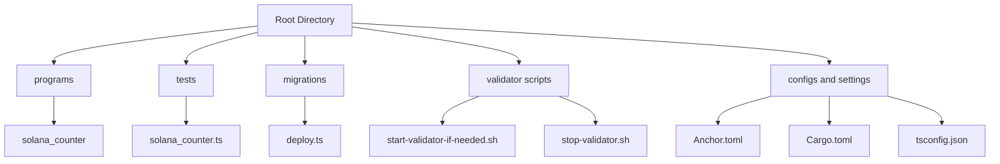
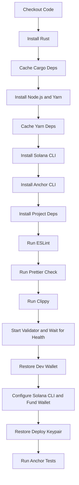

# 🧮 Solana Counter Program

[](https://github.com/rgmelvin/solana-counter/actions/workflows/ci.yml)
[](https://opensource.org/licenses/MIT)


---

A simple **Anchor**-based **Solana smart contract** demonstrating:

- Smart contract development with modern best practices
- Full CI/CD pipeline integration using GitHub Actions
- Linting, formatting, Clippy checks, and test automation
- Validator control scripts
- Future extensibility toward full-stack dApps

---

## 📦 Project Structure



---

## 🚀 CI Workflow Overview



---

## 📋 Scripts Included

| Script          | Description                                                                             |
| :-------------- | :-------------------------------------------------------------------------------------- |
| `yarn test`     | Runs Anchor tests with validator already started (`anchor test --skip-local-validator`) |
| `yarn lint`     | Runs ESLint across TypeScript tests                                                     |
| `yarn prettier` | Checks code formatting with Prettier                                                    |
| `yarn format`   | Auto-formats all code with Prettier                                                     |
| `yarn clippy`   | Runs Rust's `cargo clippy` across all targets                                           |
| `yarn check`    | Runs full local pre-push check: validator start -> lint -> prettier -> clippy -> test   |

### 🛠 Validator Control Scripts

| Script                         | Description                                                  |
| :----------------------------- | :----------------------------------------------------------- |
| `start-validator-if-needed.sh` | Starts a Solana local validator if one isn't already running |
| 'stop-validator.sh             | Stops the running Solana validator                           |

These scripts allow **local development** that mirrors the **GitHub CI environment** exactly.

---

## 🔐 GitHub Secrets Required

| Secret Name              | Description                                                                                         |
| :----------------------- | :-------------------------------------------------------------------------------------------------- |
| `SOLANA_DEV_WALLET`      | The base64-encoded private key for the development wallet used to run tests                         |
| `COUNTER_DEPLOY_KEYPAIR` | The base64-encoded deploy keypair (corresponding to your `programId` in `lib.rs` and `Anchor.toml`) |

Without these, deployment and tests **will fail**.

---

## 🛠️ Local Development Setup

### 1. Install Required Tools

- **Rust**: [Install Rust](https://www.rust-lang.org/tools/install)
- **Node.js**: [Install Node.js](https://nodejs.org/)
- **Yarn**: [Install UYarn](https://classic.yarnpkg.com/en/docs/install)
- **Solana CLI**: [Install Solana CLI (Anza Labs)](https://docs.solana.com/cli/install-solana-cli-tools)
- **Anchor CLI**:

```bash
cargo install --git https://github.com/coral-xyz/anchor avm --locked --force
avm install latest
avm use latest
```

### 2. Clone and Install

```bash
git clone https://github.com/yourname/solana-counter.git
cd solana-counter
yarn install
```

### 3. Run Locally

```bash
yarn check
```

This will automatically:

- Start a local validator (if needed)
- Lint TypeScript code
- Check Prettier formatting
- Run Rust Clippy
- Run Anchor tests

✅ Exactly like GitHub CI - ensuring perfect parity.

---

## 🚧 Future Improvements (Proposed)

- [ ] **Markdown Link Validation**: Ensure no broken internal/external links using tools like `lychee`.
- [ ] **IDL File Consistency Check**: Fail CI if `target/idl/*.json` changes but not committed.
- [ ] **Rust Smart Contract Coverage**: Experiment with `cargo tarpaulin` to measure Rust logic test coverage.
- [ ] **Grid Testing**: Extend matrix testing across multiple Node.js and Rust versions.
- [ ] **Deploy Preview Apps**: Auto-preview frontends (once built) during PRs.
- [ ] **Frontend UI**: Build a Vite or Next.js frontend to interact with the Counter contract.

---

## ⭐ Why This Projectx is Special

This project is deliberately built **not just to run**, but to:

- Teach you **enterprise-level Solana development workflows**.
- Build discipline around **code quality** and **continuous testing**.
- Bridge the gap between **blockchain backend** and **modern web2/web3 practices**.
- Future-proof your skills for real-world, production-grade Solana dApps.

---

## 📜 License

MIT License - free to use, adapt, and learn from.

---
